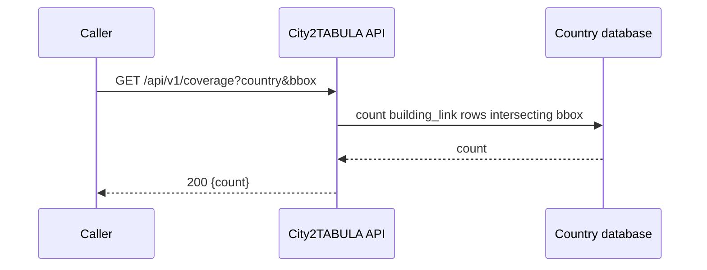
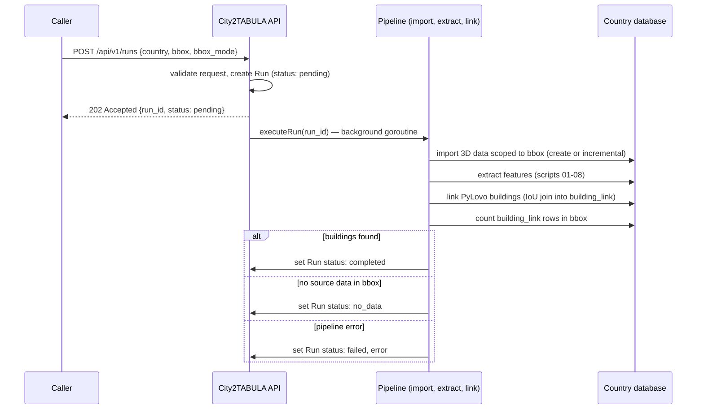
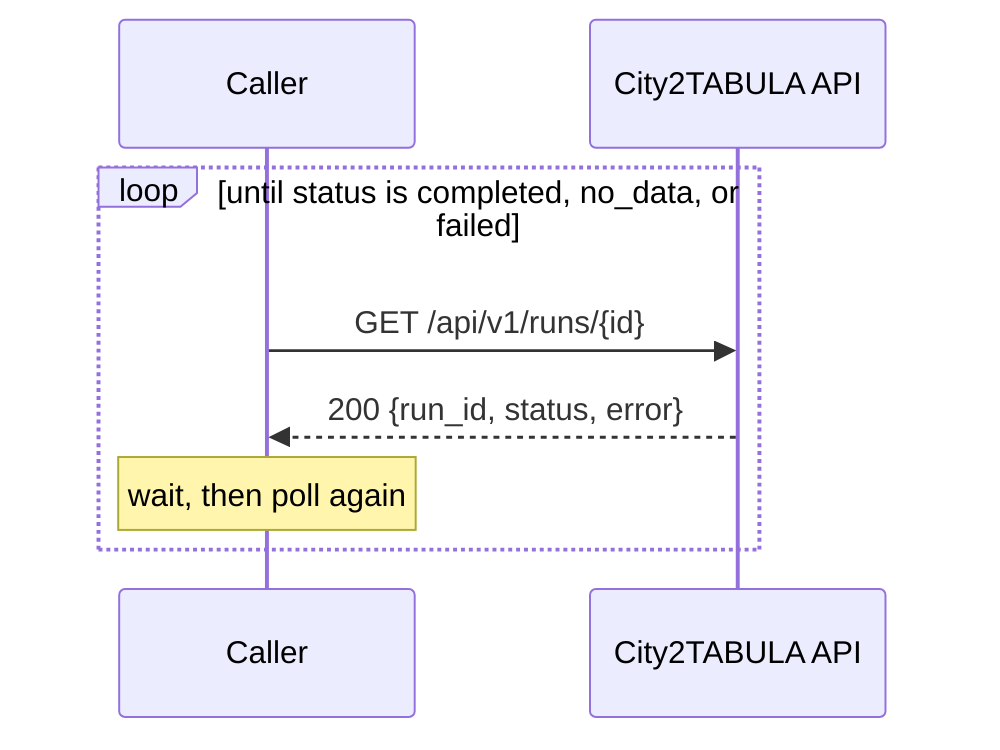
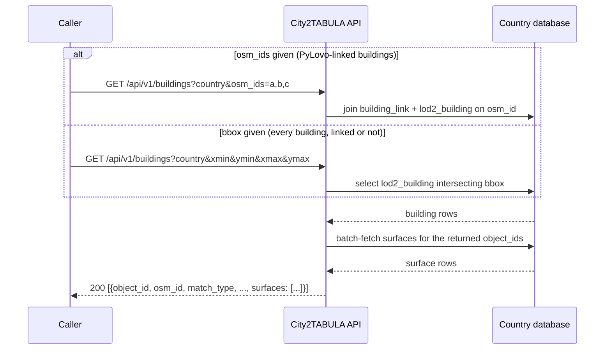
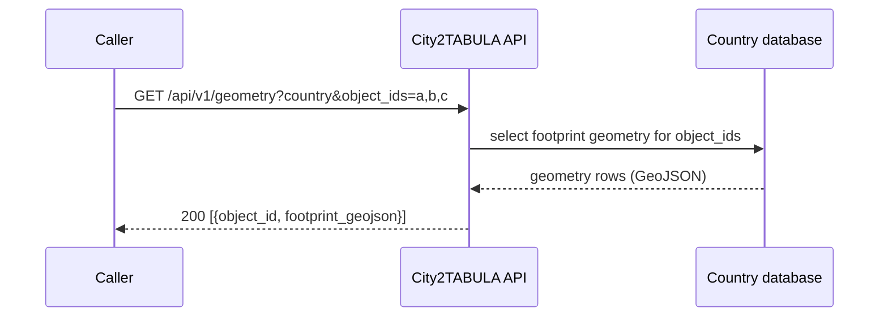

# API reference

The interactive reference lives in its own standalone page, [`openapi/index.html`](openapi/index.html), so it can be opened directly without running `mkdocs serve`. It renders [`openapi/openapi.yaml`](openapi/openapi.yaml); download that file to generate a client or import it into Postman.

!!! warning "No authentication"
    This API has none of its own and is not behind a reverse proxy. It's meant for trusted internal callers on the same network — do not expose it directly to the public internet as-is.

!!! note "Try it out needs a proxy or same-origin setup"
    The server sends no CORS headers, so Swagger UI's **Try it out** will fail against a real running instance from this docs page. Use `curl` (examples below) for hands-on testing until that's addressed.

## Workflow

| Step | Endpoint | Purpose |
|---|---|---|
| 1 | `GET /api/v1/coverage` | Cheap check: does this bbox already have extracted data? |
| 2 | `POST /api/v1/runs` | If not, trigger extraction. Returns a `run_id` immediately. |
| 3 | `GET /api/v1/runs/{id}` | Poll until `status` is `completed`, `no_data`, or `failed`. |
| 4 | `GET /api/v1/buildings` | Building + surface attributes, once data exists. |
| 5 | `GET /api/v1/geometry` | Footprint geometry, only if something needs to render it. |

`buildings` and `geometry` are separate endpoints on purpose: a calculation consumer doesn't need geometry, only a visualization consumer does, so it isn't fetched unless actually needed.

## Health check

```bash
curl http://localhost:5000/api/v1/health
```

Returns `{"status": "ok"}` if the process is up. Not authoritative for any one country — it doesn't touch a database connection.

## Checking coverage

```bash
curl "http://localhost:5000/api/v1/coverage?country=germany&xmin=8.79&ymin=53.14&xmax=8.82&ymax=53.16"
```

Returns `{"count": N}` — the number of already PyLovo-linked buildings in that bbox. `count: 0` means trigger a run before reading buildings.



## Triggering a run

```bash
curl -X POST http://localhost:5000/api/v1/runs \
  -H 'Content-Type: application/json' \
  -d '{"country":"germany","xmin":8.79,"ymin":53.14,"xmax":8.82,"ymax":53.16}'
```

The pipeline (import, feature extraction, PyLovo linking) runs in the background; the request returns immediately with a `run_id` to poll.



## Polling a run

```bash
curl http://localhost:5000/api/v1/runs/<run_id>
```

`no_data` means the pipeline ran successfully but found no source data for that bbox — not an error. `failed` means a real error; check `error` in the response.



## Reading buildings

By bbox, independent of any PyLovo link:

```bash
curl "http://localhost:5000/api/v1/buildings?country=germany&xmin=8.79&ymin=53.14&xmax=8.82&ymax=53.16"
```

By PyLovo OSM id, once a link exists:

```bash
curl "http://localhost:5000/api/v1/buildings?country=germany&osm_ids=123456,789012"
```

Each building's `surfaces` array carries per-element area/azimuth/tilt.

!!! warning "Tilt convention"
    `tilt` here is 0=vertical wall, 90=flat roof — the opposite of the common building-energy convention (0=horizontal roof, 90=vertical wall). Invert before feeding it to a consumer that expects that convention.



`osm_ids` takes precedence if both are present in the query string.

## Reading geometry

```bash
curl "http://localhost:5000/api/v1/geometry?country=germany&object_ids=DEHB01AL3AU0004T"
```


