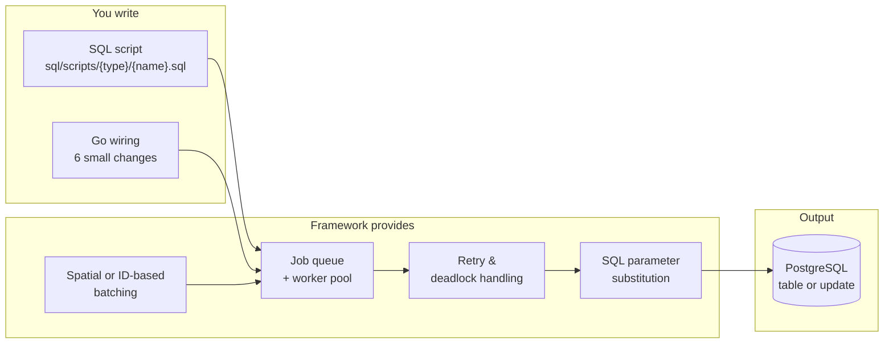

# Extending the Pipeline

This page explains how to add a new processing step to City2TABULA. The pipeline is designed so that adding a new step — whether it enriches buildings with external data, computes a new derived attribute, or links to a third-party database — follows the same repeatable pattern every time.

**What you provide:** one SQL script and six small Go changes.  
**What the framework provides for free:** parallel execution across CPU cores, deadlock retry, per-batch parameter substitution, idempotent re-runs, and CLI flag integration.

---

## The pattern

Every pipeline step maps to the same structure:



---

## Step-by-step checklist

The six Go changes are always in the same six files. Once you know the pattern, adding a new step takes under an hour.

### 1. Write the SQL script

Create a file in `sql/scripts/{type}/{name}.sql`. The directory name (`{type}`) groups related scripts — use `main` for extraction steps, `link` for external data linking.

Use `{placeholders}` for any value that changes per run:

| Placeholder | Resolved to |
|---|---|
| `{city2tabula_schema}` | `city2tabula` |
| `{lod_schema}` | `lod2` or `lod3` |
| `{srid}` | Native CRS of the 3D data (e.g. `25832`) |
| `{building_ids}` | `(1, 2, 3, ...)` — the current batch |
| `{country}` | Country name from config |
| `{pylovo_schema}` | PyLovo schema (e.g. `public`) |

Scripts within a directory are sorted alphabetically and executed in order. Use a numeric prefix (`01_`, `02_`) to control that order.

### 2. Register the script directory

In `internal/config/sql.go`, add a directory constant and a field to `SQLScripts`:

```go
// Add constant
SQLMyNewScriptDir = SQLScriptDir + "my-new-type" + string(os.PathSeparator)

// Add field to SQLScripts struct
MyNewScripts []string

// Load in LoadSQLScripts()
myNewScripts, err := loadSQLFilesFromDir(SQLMyNewScriptDir)
// ...add to return struct
```

### 3. Add a JobType and queue builder

In `internal/process/orchestrator.go`, add a constant and a queue builder function:

```go
// Add JobType constant
MyNewStep JobType = "my_new_step"

// Add to the switch in createJob()
case MyNewStep:
    prefix, lodLevel = "MY_NEW_STEP", 2   // set lodLevel=-1 if no LOD context needed

// Add queue builder function
func MyNewStepJobQueue(config *config.Config, batches [][]int64) (*JobQueue, error) {
    scripts, queue, err := loadScriptsAndQueue(config)
    if err != nil {
        return nil, err
    }
    for _, batch := range batches {
        queue.Enqueue(createJob(batch, scripts.MyNewScripts, MyNewStep))
    }
    return queue, nil
}
```

### 4. Add a Run function

In `internal/process/feature_extraction.go`, add the entry-point function. Choose the right batching strategy:

- **ID-based batching** — use `CreateBatches(ids, cfg.Batch.Size)` when batch order doesn't matter
- **Spatial grid batching** — use `getGridBatches(...)` when buildings in a batch must be geographically co-located (e.g. for spatial joins against external datasets)

```go
func RunMyNewStep(cfg *config.Config, pool *pgxpool.Pool) error {
    ids, err := getBuildingIDsFromCityDB(pool, cfg.DB.Schemas.Lod2)
    // ... apply BuildingLimit, create batches, build queue, run
    return RunJobQueue(jobQueue, pool, cfg)
}
```

### 5. Add a CLI flag

In `internal/flags/flags.go`:

```go
// Add to Flags struct
MyNewStep bool

// Register in ParseFlags()
flag.BoolVar(&f.MyNewStep, "my-new-step", false, "What this step does")

// Add message type and messages
type MyNewStepMsg Msg
MyNewStepMessages = MyNewStepMsg{
    Progress: "Running my new step...",
    Success:  "My new step completed",
    Error:    "My new step failed",
}
```

### 6. Wire the flag in main

In `cmd/main.go`, add one block:

```go
if f.MyNewStep {
    utils.Info.Println(flagMessages.MyNewStep.Progress)
    if err := process.RunMyNewStep(&config, pool); err != nil {
        utils.Error.Fatalf(flagMessages.MyNewStep.Error+": %v", err)
    }
    utils.Info.Println(flagMessages.MyNewStep.Success)
}
```

---

## What the framework handles automatically

You never need to implement these — they apply to every step by default:

| Concern | How it's handled |
|---|---|
| **Parallel execution** | `RunJobQueue` distributes batches across a worker pool (default: CPU count, configurable via `THREAD_COUNT`) |
| **Deadlock retry** | Runner retries up to 5 times with jitter on PostgreSQL deadlock errors |
| **General error retry** | Runner retries up to 3 times with exponential backoff |
| **Idempotency** | Your SQL script handles this — typically a `DELETE ... WHERE building_id IN {building_ids}` before the INSERT, or an `ON CONFLICT DO UPDATE` |
| **Parameter substitution** | All `{placeholder}` tokens in your script are substituted from `config.SQLParameters` before execution |
| **Building limit** | Respect `cfg.Batch.BuildingLimit` in your `Run*` function to cap processing during development |

---

## Worked example: PyLovo link (`-link-pylovo`)

The PyLovo link step was added following this exact pattern. Here is what was done for each step:

**1. SQL script** — `sql/scripts/link/pylovo/01_build_pylovo_link.sql`  
Spatial join of `lod2_building` footprints against `pylovo.res` and `pylovo.oth`. Uses `{pylovo_schema}` and `{srid}` placeholders. Includes an internal `batch_bbox` CTE to pre-filter PyLovo before the IoU join, which reduced runtime from 4 minutes to 1.56 seconds for 1,000 buildings.

**2. Config** — added `SQLPylvoLinkScriptDir` and `PyLovoLinkScripts []string` to `internal/config/sql.go`

**3. Orchestrator** — added `PyLovoLink JobType` and `PyLovoLinkJobQueue()` to `internal/process/orchestrator.go`

**4. Run function** — added `RunPyLovoLinkBuild()` to `internal/process/feature_extraction.go`.  
Uses **spatial grid batching** (`getGridBatches`) instead of ID-based batching because the IoU join benefits from buildings being geographically co-located — a tight bounding box means only a small subset of PyLovo buildings need to be loaded per batch.

**5. Flag** — added `-link-pylovo` to `internal/flags/flags.go`.  
Named after the specific data source, not generic OSM — a future OGR2OGR-based source gets its own `-link-ogr2ogr` flag with its own scripts subdirectory.

**6. Main** — added the `if f.LinkPylovo` block to `cmd/main.go`

---

## Adding a new SQL parameter

If your script needs a value not already in `SQLParameters`, add it in two places:

```go
// internal/config/sql.go — add to SQLParameters struct
MyNewParam string `param:"my_new_param"`

// Same file — populate in GetSQLParameters()
MyNewParam: c.DB.Schemas.MyNew,  // or wherever the value comes from
```

Then add `{my_new_param}` in your SQL script. The substitution happens automatically.

!!! info "Adding config from environment"
    If your new parameter comes from an environment variable, add the `GetEnv` call in the appropriate `load*Config()` function in `internal/config/`. Document the variable in `.env.example`.
