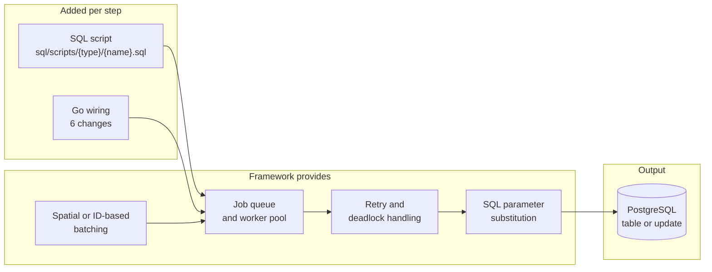

# Extending the Pipeline

A new processing step follows the same pattern whether it enriches buildings with external data, computes a derived attribute, or links to a third-party database.

A step consists of one SQL script and six Go changes. The framework supplies parallel execution across CPU cores, deadlock retry, per-batch parameter substitution, idempotent re-runs and CLI flag integration.

---

## The pattern

Every pipeline step maps to the same structure:

The diagram shows which parts a new step adds and which the framework already provides.


```mermaid
flowchart LR
    subgraph "Added per step"
        SQL["SQL script<br>sql/scripts/{type}/{name}.sql"]
        GO["Go wiring<br>6 changes"]
    end

    subgraph "Framework provides"
        BATCH["Spatial or ID-based<br>batching"]
        QUEUE["Job queue<br>and worker pool"]
        RETRY["Retry and<br>deadlock handling"]
        PARAM["SQL parameter<br>substitution"]
    end

    subgraph "Output"
        DB[("PostgreSQL<br>table or update")]
    end

    SQL --> QUEUE
    GO --> QUEUE
    BATCH --> QUEUE
    QUEUE --> RETRY
    RETRY --> PARAM
    PARAM --> DB
```

---

## Step-by-step checklist

The six Go changes are always in the same six files.

### 1. Write the SQL script

Create a file in `sql/scripts/{type}/{name}.sql`. The directory name (`{type}`) groups related scripts: `main` for extraction steps, `link` for external data linking.

Use `{placeholders}` for any value that changes per run:

| Placeholder | Resolved to |
|---|---|
| `{city2tabula_schema}` | `city2tabula` |
| `{lod_schema}` | `lod2` or `lod3` |
| `{srid}` | Native CRS of the 3D data (e.g. `25832`) |
| `{building_ids}` | `(1, 2, 3, ...)`, the current batch |
| `{country}` | Country name from config |
| `{pylovo_schema}` | PyLovo schema (e.g. `public`) |

Scripts within a directory are sorted alphabetically and executed in order. Use a numeric prefix (`01_`, `02_`) to control that order.

### 2. Register the script directory

In `internal/config/sql.go`, add a directory constant and a field to `SQLScripts`:

```go
// Add constant
SQLMyNewScriptDir = SQLScriptDir + "my-new-type" + string(os.PathSeparator)

// Add field to SQLScripts struct
MyNewScripts []string

// Load in LoadSQLScripts()
myNewScripts, err := loadSQLFilesFromDir(SQLMyNewScriptDir)
// ...add to return struct
```

### 3. Add a JobType and queue builder

In `internal/process/orchestrator.go`, add a constant and a queue builder function:

```go
// Add JobType constant
MyNewStep JobType = "my_new_step"

// Add to the switch in createJob()
case MyNewStep:
    prefix, lodLevel = "MY_NEW_STEP", 2   // set lodLevel=-1 if no LOD context needed

// Add queue builder function
func MyNewStepJobQueue(config *config.Config, batches [][]int64) (*JobQueue, error) {
    scripts, queue, err := loadScriptsAndQueue(config)
    if err != nil {
        return nil, err
    }
    for _, batch := range batches {
        queue.Enqueue(createJob(batch, scripts.MyNewScripts, MyNewStep))
    }
    return queue, nil
}
```

### 4. Add a Run function

In `internal/process/feature_extraction.go`, add the entry-point function with the batching strategy the step needs:

- **ID-based batching**: `CreateBatches(ids, cfg.Batch.Size)`, when batch order does not matter.
- **Spatial grid batching**: `getGridBatches(...)`, when buildings in a batch must be geographically co-located, for example for a spatial join against an external dataset.

```go
func RunMyNewStep(cfg *config.Config, pool *pgxpool.Pool) error {
    ids, err := getBuildingIDsFromCityDB(pool, cfg.DB.Schemas.Lod2)
    // ... apply BuildingLimit, create batches, build queue, run
    return RunJobQueue(jobQueue, pool, cfg)
}
```

### 5. Add a CLI flag

In `internal/flags/flags.go`:

```go
// Add to Flags struct
MyNewStep bool

// Register in ParseFlags()
flag.BoolVar(&f.MyNewStep, "my-new-step", false, "What this step does")

// Add message type and messages
type MyNewStepMsg Msg
MyNewStepMessages = MyNewStepMsg{
    Progress: "Running my new step...",
    Success:  "My new step completed",
    Error:    "My new step failed",
}
```

### 6. Wire the flag in main

In `cmd/c2t/main.go`, add one block:

```go
if f.MyNewStep {
    utils.Info.Println(flagMessages.MyNewStep.Progress)
    if err := process.RunMyNewStep(&config, pool); err != nil {
        utils.Error.Fatalf(flagMessages.MyNewStep.Error+": %v", err)
    }
    utils.Info.Println(flagMessages.MyNewStep.Success)
}
```

---

## Adding a new SQL parameter

A value not already in `SQLParameters` is added in two places:

```go
// internal/config/sql.go: add to the SQLParameters struct
MyNewParam string `param:"my_new_param"`

// Same file: populate in GetSQLParameters()
MyNewParam: c.DB.Schemas.MyNew,  // or wherever the value comes from
```

The script then uses `{my_new_param}`, which is substituted automatically.

!!! info "Adding config from environment"
    A parameter that comes from an environment variable needs a `GetEnv` call in the matching `load*Config()` function in `internal/config/`, and an entry in `.env.example`.

## What the framework handles automatically

These apply to every step and need no per-step code:

| Concern | How it's handled |
|---|---|
| **Parallel execution** | `RunJobQueue` distributes batches across a worker pool (default: CPU count, configurable via `THREAD_COUNT`) |
| **Deadlock retry** | Runner retries up to 5 times with jitter on PostgreSQL deadlock errors |
| **General error retry** | Runner retries up to 3 times with exponential backoff |
| **Idempotency** | Handled by the SQL script, typically a `DELETE ... WHERE building_id IN {building_ids}` before the INSERT, or an `ON CONFLICT DO UPDATE` |
| **Parameter substitution** | All `{placeholder}` tokens in the script are substituted from `config.SQLParameters` before execution |
| **Building limit** | `cfg.Batch.BuildingLimit`, which the `Run*` function applies to cap processing during development |

---

## Worked example: PyLovo link (`-link-pylovo`)

The PyLovo link step was added following this exact pattern.

| Nr. | Step | File | Change |
|---|---|---|---|
| 1 | SQL script | `sql/scripts/link/pylovo/01_build_pylovo_link.sql` | Spatial join of `lod2_building` footprints against `pylovo.res` / `oth` using `{pylovo_schema}` and `{srid}`. A `batch_bbox` CTE pre-filters PyLovo before the IoU join, reducing runtime from 4 min to 1.56 s for 1,000 buildings. |
| 2 | Config | `internal/config/sql.go` | Added `SQLPylvoLinkScriptDir` constant and `PyLovoLinkScripts []string` field. |
| 3 | Orchestrator | `internal/process/orchestrator.go` | Added `PyLovoLink` JobType and `PyLovoLinkJobQueue()` queue builder. |
| 4 | Run function | `internal/process/feature_extraction.go` | Added `RunPyLovoLinkBuild()` with spatial grid batching (`getGridBatches`). IoU join requires buildings to be geographically co-located so the bounding box pre-filter stays tight. |
| 5 | Flag | `internal/flags/flags.go` | Added `-link-pylovo`, named after the data source. A future OGR2OGR source gets its own `-link-ogr2ogr` flag and subdirectory with no changes to existing code. |
| 6 | Main | `cmd/c2t/main.go` | Added `if f.LinkPylovo` block. |

---

