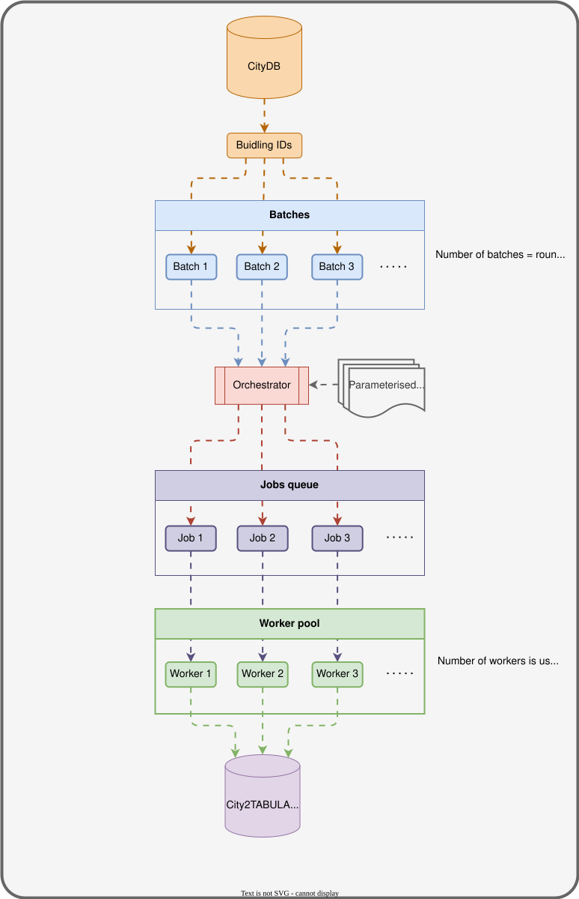
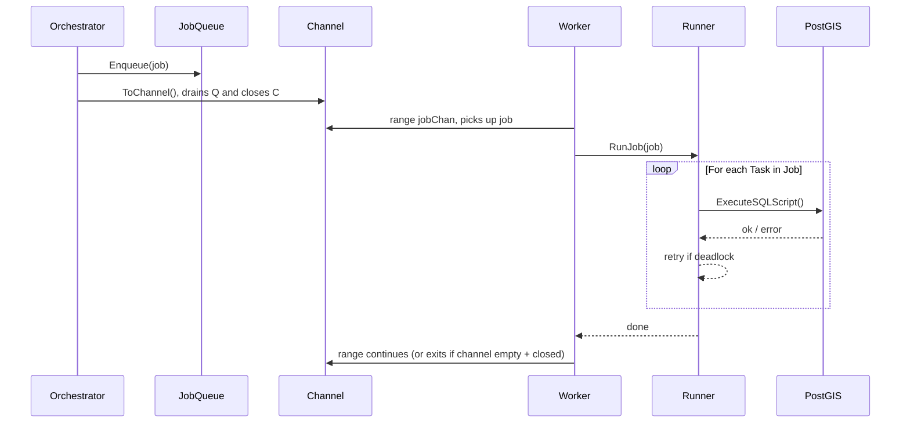

# Job Queue and Worker Pipeline

How City2TABULA hands work from a queue to a pool of parallel workers.

---

## The problem it solves

Feature extraction runs the same set of SQL scripts over thousands of building batches. Those batches run concurrently, one per CPU core, without interfering with each other. The structure is a **producer/consumer pipeline**:

- One goroutine fills a queue with jobs (producer).
- Many worker goroutines pull jobs from a shared channel and execute them (consumers).

---

## What is a Go channel?

A channel is a thread-safe conveyor belt: values go in one end and workers take them off the other. Once the belt is empty and the sender has closed the channel, workers know nothing more is coming.

```go
ch := make(chan *Job, 10) // buffered channel, holds up to 10 items without blocking
ch <- job                 // put a job on the belt
j := <-ch                 // pick a job off the belt
close(ch)                 // signal: no more jobs coming
```

A `for job := range ch` loop in a worker will automatically stop when the channel is closed and drained, with no manual completion check.

---

## `JobQueue.ToChannel()`

`ToChannel()` is the bridge between the queue and the worker pool. It drains every job from the queue into a buffered channel, closes it, and returns it.

```go
// internal/process/queue.go

func (q *JobQueue) ToChannel() <-chan *Job {
    ch := make(chan *Job, q.Len()) // size the buffer to hold all jobs upfront
    for !q.IsEmpty() {
        if j := q.Dequeue(); j != nil {
            ch <- j
        }
    }
    close(ch) // workers will stop ranging once this is drained
    return ch
}
```

**Buffering the whole queue** keeps the producer from blocking: it fills the channel in one pass and returns. Workers then take jobs without coordination from the caller.

**Closing the channel** tells every worker that no more jobs are coming. Without it, workers block forever on the next receive.

---

## How the worker pool uses it

`RunJobQueue` is the main entry point. It calls `ToChannel()`, spins up one goroutine per configured thread, and waits for all of them to finish.

```go
// internal/process/worker.go

func RunJobQueue(queue *JobQueue, conn *pgxpool.Pool, cfg *config.Config) error {
    jobChan := queue.ToChannel() // drain queue → channel (closed and ready)

    var wg sync.WaitGroup
    for i := 1; i <= cfg.Batch.Threads; i++ {
        wg.Add(1)
        go NewWorker(i).Start(jobChan, conn, &wg, cfg) // each worker ranges over jobChan
    }
    wg.Wait() // block until every worker is done
    return nil
}
```

Each worker runs:

```go
for job := range jobChan { // stops automatically when channel is closed + empty
    runner.RunJob(job, conn, workerID)
}
```

---

## Concurrency workflow diagram



---

## Sequence: one job's journey



---

## Where to look in the code

| File | What it does |
|---|---|
| `internal/process/queue.go` | `JobQueue` struct, `ToChannel()` |
| `internal/process/worker.go` | `RunJobQueue()`, `Worker.Start()` |
| `internal/process/runner.go` | `RunJob()`, retry logic |
| `internal/process/orchestrator.go` | Queue builder functions (one per pipeline phase) |
| `internal/process/task.go` | `Task` struct, including the `LodLevel` field |
