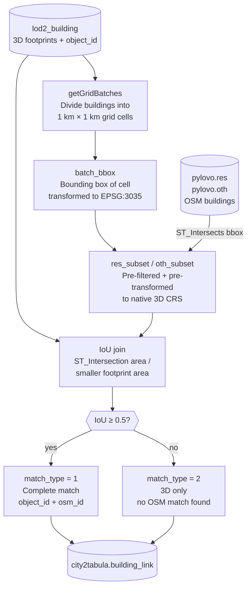

# PyLovo Building Link

The PyLovo link step connects 3D building footprints extracted by City2TABULA to the OSM building data held in a [PyLovo2EnerPlanET](https://github.com/enerplanet/pylovo2enerplanet) database. The result is the `city2tabula.building_link` table, which records whether each 3D building has a matching OSM building, which PyLovo table it belongs to (`res` for residential, `oth` for commercial/public), and how confident the spatial match is.

This step is optional. Feature extraction (`-extract-features`) runs independently; linking enriches the output with OSM semantics and is needed only when connecting City2TABULA output to EnerPlanET.

---

## How it works

Each 3D building footprint is matched to a PyLovo building by **Intersection over Union (IoU)** — the area of overlap divided by the area of the smaller footprint. A match is accepted when IoU ≥ 0.5.

Residential buildings (`res`) are checked first. A commercial/public match (`oth`) is only considered when no `res` building meets the threshold.


To avoid scanning the full PyLovo database for every batch of 3D buildings, the pipeline uses **spatial grid batching**: buildings are grouped into 1 km × 1 km cells, and only the PyLovo buildings whose footprint intersects the cell's bounding box are loaded for comparison. This keeps each join small and predictable regardless of the total number of PyLovo buildings.



---

## Running the link step

Feature extraction must have run first so that `lod2_building` is populated with footprint geometries.

```bash
# Run PyLovo link
./city2tabula -link-pylovo
```

---

## Configuration

| Variable | Default | Description |
|---|---|---|
| `PYLOVO_SCHEMA` | `public` | PostgreSQL schema containing `res` and `oth` tables |
| `PYLOVO_LINK_GRID_SIZE` | `1000` | Grid cell side length in metres. Smaller values give tighter pre-filtering but create more jobs. |

Set these in your `.env` file alongside the existing database variables.

---

## Output: `city2tabula.building_link`

One row per 3D building that has a footprint geometry and a valid `object_id`. The pipeline is idempotent — re-running `-link-pylovo` after updated PyLovo data will overwrite existing rows for the affected buildings.

| Column | Type | Description |
|---|---|---|
| `object_id` | `VARCHAR(100)` | Stable 3D city model identifier (supports CityGML and CityJSON) |
| `osm_id` | `TEXT` | PyLovo OSM building identifier — `NULL` when no match |
| `pylovo_table` | `VARCHAR(3)` | `res` (residential) or `oth` (commercial/public/industrial) — `NULL` when no match |
| `match_type` | `SMALLINT` | See match types below |
| `match_confidence` | `DOUBLE PRECISION` | IoU score 0–1; `NULL` when no match |
| `country_code` | `CHAR(2)` | ISO 3166-1 alpha-2 code derived from the `COUNTRY` env var (e.g. `DE`, `NL`) |
| `geom` | `GEOMETRY(MultiPolygon)` | 3D footprint in native source CRS |
| `srid` | `INTEGER` | SRID of `geom` (e.g. 25832 for Germany) |

### Match types

| Value | Meaning |
|---|---|
| `1` | Complete — 3D building matched to an OSM building. All attributes available. |
| `2` | 3D only — no OSM building found within IoU threshold. OSM attributes must be inferred. |
| `3` | OSM only — OSM building with no 3D counterpart. Populated separately, not by this pipeline. |

---

## Extending to other data sources

The link pipeline is designed for one data source per subdirectory under `sql/scripts/link/`:

```
sql/scripts/link/
└── pylovo/
    └── 01_build_pylovo_link.sql   ← this pipeline
```

A future OGR2OGR-based OSM import would add a parallel subdirectory (`ogr2ogr/`) with its own script and a new `-link-ogr2ogr` flag — no changes to the existing pipeline.

!!! info "Pre-requisite"
    `pylovo.res` and `pylovo.oth` must be populated by the [pylovo2enerplanet/datapipeline](https://github.com/enerplanet/pylovo2enerplanet/tree/main/datapipeline) before running `-link-pylovo`. The link step reads from PyLovo but does not modify it.
