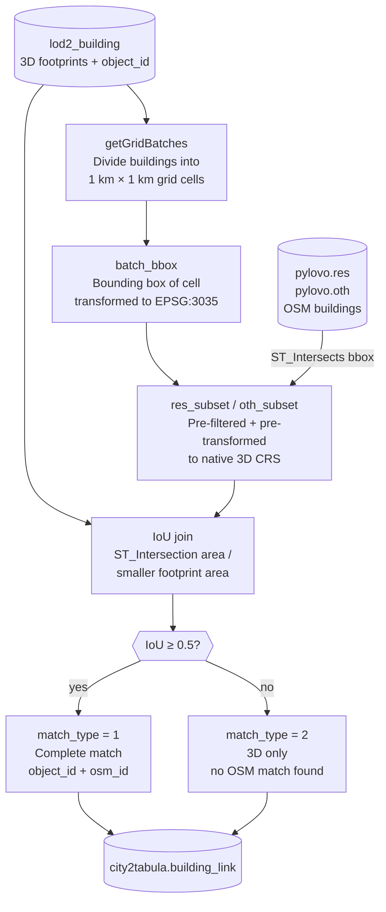

# PyLovo Building Link

The PyLovo link step connects 3D building footprints extracted by City2TABULA to the OSM building data held in an [enerplanet-pylovo](https://github.com/enerplanet/enerplanet-pylovo) database. The result is the `city2tabula.building_link` table, which records whether each 3D building has a matching OSM building, which PyLovo table it belongs to (`res` for residential, `oth` for commercial/public), and how confident the spatial match is.

This step is optional. Feature extraction (`-extract-features`) runs independently; linking enriches the output with OSM semantics and is needed only when connecting City2TABULA output to EnerPlanET.

---

## How it works

Each 3D building footprint is matched to a PyLovo building by **Intersection over Union (IoU)** — the area of overlap divided by the area of the smaller footprint. A match is accepted when IoU ≥ 0.5.

Residential buildings (`res`) are checked first. A commercial/public match (`oth`) is only considered when no `res` building meets the threshold.


To avoid scanning the full PyLovo database for every batch of 3D buildings, the pipeline uses **spatial grid batching**: buildings are grouped into 1 km × 1 km cells, and only the PyLovo buildings whose footprint intersects the cell's bounding box are loaded for comparison. This keeps each join small and predictable regardless of the total number of PyLovo buildings.


```mermaid
flowchart TD
    A[("lod2_building<br>3D footprints + object_id")]
    B["getGridBatches<br>Divide buildings into<br>1 km × 1 km grid cells"]
    C["batch_bbox<br>Bounding box of cell<br>transformed to EPSG:3035"]
    D[("pylovo.res<br>pylovo.oth<br>OSM buildings")]
    E["res_subset / oth_subset<br>Pre-filtered + pre-transformed<br>to native 3D CRS"]
    F["IoU join<br>ST_Intersection area /<br>smaller footprint area"]
    G{{"IoU ≥ 0.5?"}}
    H["match_type = 1<br>Complete match<br>object_id + osm_id"]
    I["match_type = 2<br>3D only<br>no OSM match found"]
    J[("city2tabula.building_link")]

    A --> B
    B --> C
    C --> E
    D -->|ST_Intersects bbox| E
    A --> F
    E --> F
    F --> G
    G -->|yes| H
    G -->|no| I
    H --> J
    I --> J
```

---

## Running the link step

[Feature extraction](https://thd-spatial-ai.github.io/city2tabula/installation/setup/) must have run first so that `lod2_building` is populated with footprint geometries.

```bash
# Run PyLovo link
./c2t -link-pylovo
```

---

## Configuration

| Variable | Default | Description |
|---|---|---|
| `PYLOVO_SCHEMA` | `public` | Schema holding local `res` and `oth` tables. Ignored when `PYLOVO_FDW_HOST` is set. |
| `PYLOVO_LINK_GRID_SIZE` | `1000` | Grid cell side length in metres. Smaller values give tighter pre-filtering but create more jobs. |

Set these in your `.env` file alongside the existing database variables. For a
central PyLovo database on a separate server, see [Federated setup](#federated-setup-postgres_fdw).

---

## Federated setup (postgres_fdw)

Under the database-per-country layout each country's City2TABULA database is
separate, so `pylovo.res` / `pylovo.oth` are not in the same database and cannot
be joined directly. Setting `PYLOVO_FDW_HOST` makes `-link-pylovo` reach the
central PyLovo database through
[`postgres_fdw`](https://www.postgresql.org/docs/current/postgres-fdw.html):
each run drops and recreates the foreign server `pylovo_srv`, a user mapping for
the connecting role, and schema `pylovo` holding foreign tables `res` and `oth`.
A changed host or credential in `.env` takes effect on the next run with no
manual SQL.

Leave `PYLOVO_FDW_HOST` empty to read `res` / `oth` as local tables in
`PYLOVO_SCHEMA` instead (single-database deployments, tests).

### Prerequisites

| Requirement | Where | Note |
|---|---|---|
| PostgreSQL with `postgres_fdw` | City2TABULA database server | contrib module, ships with standard PostgreSQL |
| PostGIS, and `res` / `oth` in schema `public` | PyLovo database | `IMPORT FOREIGN SCHEMA` reads `public` |
| Network route to `PYLOVO_FDW_HOST:PYLOVO_FDW_PORT` | from the City2TABULA **database server** | `postgres_fdw` connects server to server, not from where `c2t` runs |
| `DB_USER` may run `CREATE EXTENSION` / `CREATE SERVER` | City2TABULA database | superuser, or a role granted `USAGE ON FOREIGN DATA WRAPPER postgres_fdw` |

### PyLovo side (once)

Create a read-only login for City2TABULA on the PyLovo database:

```sql
CREATE ROLE c2t_fdw_reader LOGIN PASSWORD '<strong-password>';
GRANT CONNECT ON DATABASE <pylovo_db>   TO c2t_fdw_reader;
GRANT USAGE   ON SCHEMA public          TO c2t_fdw_reader;
GRANT SELECT  ON public.res, public.oth,
                 public.spatial_ref_sys TO c2t_fdw_reader;
```

`res` and `oth` are the only tables read; `spatial_ref_sys` is needed for the
CRS transform in the link query.

### City2TABULA side

Add to `.env`:

| Variable | Value |
|---|---|
| `PYLOVO_FDW_HOST` | PyLovo host, resolvable from the City2TABULA database server |
| `PYLOVO_FDW_PORT` | PyLovo port (default `5432`) |
| `PYLOVO_FDW_DBNAME` | PyLovo database name |
| `PYLOVO_FDW_USER` | `c2t_fdw_reader` |
| `PYLOVO_FDW_PASSWORD` | the role's password |

`c2t` exits on start if `PYLOVO_FDW_HOST` is set but any of dbname, user, or
password is missing.

### Run and verify

```bash
./c2t -link-pylovo
```

```sql
-- foreign tables reachable
SELECT count(*) FROM pylovo.res;
SELECT count(*) FROM pylovo.oth;

-- link result
SELECT match_type, count(*) FROM city2tabula.building_link GROUP BY match_type;
```

### Teardown

```sql
-- City2TABULA database
DROP SERVER pylovo_srv CASCADE;
DROP SCHEMA pylovo;

-- PyLovo database
DROP ROLE c2t_fdw_reader;
```

### Notes

- One `pylovo_srv` per City2TABULA database; each country database sets it up on its own `-link-pylovo` run.
- The user mapping is `FOR CURRENT_USER`, i.e. the `DB_USER` role. If a different role runs `-link-pylovo`, run it once as that role to create the mapping.
- `res` / `oth` are country-agnostic. The link query's EPSG:3035 bounding-box pre-filter isolates the current extent, so a shared multi-country PyLovo database is fine.
- The bbox pre-filter is computed from local rows, so `postgres_fdw` pulls the batch's `res` / `oth` geometry across the connection and filters locally. Acceptable at city scale; not yet optimised for country-wide runs.
- `PYLOVO_FDW_PASSWORD` lives in `.env` (gitignored). Rotate per your security policy; the tool re-applies it on the next run.

---

## Output: `city2tabula.building_link`

One row per 3D building that has a footprint geometry and a valid `object_id`. The pipeline is idempotent — re-running `-link-pylovo` after updated PyLovo data will overwrite existing rows for the affected buildings.

| Column | Type | Description |
|---|---|---|
| `object_id` | `VARCHAR(100)` | Stable 3D city model identifier (supports CityGML and CityJSON) |
| `osm_id` | `TEXT` | PyLovo OSM building identifier — `NULL` when no match |
| `pylovo_table` | `VARCHAR(3)` | `res` (residential) or `oth` (commercial/public/industrial) — `NULL` when no match |
| `match_type` | `SMALLINT` | See match types below |
| `match_confidence` | `DOUBLE PRECISION` | IoU score 0–1; `NULL` when no match |
| `country_code` | `CHAR(2)` | ISO 3166-1 alpha-2 code derived from the `COUNTRY` env var (e.g. `DE`, `NL`) |
| `geom` | `GEOMETRY(MultiPolygon)` | 3D footprint in native source CRS |
| `srid` | `INTEGER` | SRID of `geom` (e.g. 25832 for Germany) |

### Match types

| Value | Meaning |
|---|---|
| `1` | Complete — 3D building matched to an OSM building. All attributes available. |
| `2` | 3D only — no OSM building found within IoU threshold. OSM attributes must be inferred. |
| `3` | OSM only — OSM building with no 3D counterpart. Populated separately, not by this pipeline. |

---

## Extending to other data sources

The link pipeline is designed for one data source per subdirectory under `sql/scripts/link/`:

```
sql/scripts/link/
└── pylovo/
    └── 01_build_pylovo_link.sql   ← this pipeline
```

A future OGR2OGR-based OSM import would add a parallel subdirectory (`ogr2ogr/`) with its own script and a new `-link-ogr2ogr` flag — no changes to the existing pipeline.

!!! info "Pre-requisite"
    `res` and `oth` must be populated by the [enerplanet-pylovo/datapipeline](https://github.com/enerplanet/enerplanet-pylovo/tree/main/datapipeline) before running `-link-pylovo`, either as local tables in `PYLOVO_SCHEMA` or in the central database named by `PYLOVO_FDW_*`. The link step reads from PyLovo but does not modify it.
