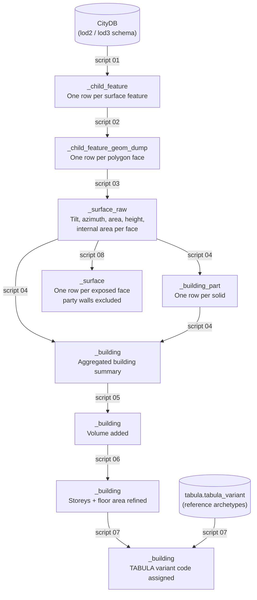

# SQL Extraction Pipeline

This section documents the eight SQL scripts that transform raw 3D building geometry from the CityDB database into a structured set of building features ready for TABULA classification.

The scripts run in order, numbered `01_` through `08_`. Each script reads from the output of the previous one, so the pipeline is strictly sequential within a batch of buildings.

---

## What it does

Given a batch of building IDs, the pipeline:

1. Finds all surface polygons that belong to each building (roof, wall, ground faces), across every solid of the building.
2. Flattens compound multi-polygon geometries into individual polygon faces.
3. Computes a surface normal for each face, then derives tilt, azimuth, area, and height, and marks the faces that lie between two solids of the same building as internal.
4. Aggregates those per-surface values into one row per solid, then one summary row per building.
5. Approximates building volume from height × footprint area.
6. Refines the storey count and total floor area.
7. Matches each building to its closest TABULA archetype using nearest-neighbour search in feature space.
8. Writes the resolved surface table: one row per exposed polygon face or face piece, party-wall surfaces excluded.

---

## Data flow

---

## Script reference

| Script | Purpose | Writes to |
|--------|---------|-----------|
| [01 Get child features](01-get-child-features.md) | Collect the surface features of every solid of each Building | `_child_feature` |
| [02 Dump geometry](02-dump-geometry.md) | Explode multi-polygon surfaces to individual polygon faces | `_child_feature_geom_dump` |
| [03 Surface attributes](03-surface-attributes.md) | Compute surface normal, tilt, azimuth, area, and height per face; mark faces between solids of a building as internal | `_surface_raw` |
| [04 Building features](04-building-features.md) | Aggregate surface attributes into one row per solid, then one row per building | `_building_part`, `_building` |
| [05 Volume](05-volume.md) | Approximate building volume from height × footprint | `_building` (UPDATE) |
| [06 Storeys](06-storeys.md) | Refine storey count; overwrite floor area as footprint × storeys | `_building` (UPDATE) |
| [07 TABULA labelling](07-tabula-labelling.md) | Nearest-neighbour match to closest TABULA archetype | `_building` (UPDATE) |
| 08 Build surface | Copy each exposed surface face or face piece into the resolved table, excluding party walls | `_surface` |

---

## Key concepts

### LoD (Level of Detail)

CityGML defines several levels of geometric detail for buildings. City2TABULA works with **LoD2** (simple roof shapes, no interior) and **LoD3** (detailed facades). Each LoD is stored in its own database schema (`lod2` or `lod3`); the scripts use `{lod_schema}` as a placeholder that is substituted at runtime.

### Buildings and BuildingParts

A building is a CityGML `Building` feature (objectclass `901`), and every output row is keyed by the Building's own `object_id`. CityGML lets a Building carry its geometry itself or split it across `BuildingPart` features (`902`), and sources use that freedom differently:

| Source | Features owning a solid | Wall between two solids of one building |
|---|---|---|
| Bremen LoD2 | The Building; no parts | Not applicable |
| 3DBAG (NL) | Exactly one BuildingPart (`<id>-0`); the Building carries LoD0 only | Not applicable |
| Vienna LoD2 | The Building when it has no parts, otherwise two or more BuildingParts | Modelled on both solids |
| Prague LoD3 | The Building and each of its BuildingParts | Omitted on both solids |

The pipeline applies one rule to all of them. A building's geometry is every `lodNSolid` owned by the Building or by any BuildingPart below it. A face of one solid that lies against a face of another solid of the same building is internal and is excluded from areas and from `_surface`; where a source omits those faces, nothing is found to exclude. A building's heights are the footprint-weighted mean of its solids' heights, so height × footprint and footprint × storeys equal the sums over its solids.

BuildingInstallation features (`905`) are not part of the envelope and are ignored. Faces between two different buildings (party walls) are a separate step, not yet wired in.

### Surface types

Each building solid is decomposed into typed surface features:

| CityGML type | Meaning |
|---|---|
| `RoofSurface` | The roof polygon(s) |
| `WallSurface` | Facade/wall polygon(s) |
| `GroundSurface` | The building footprint polygon(s) on the ground |

Scripts 03 and 04 treat these three types differently. For example, tilt and azimuth are computed differently for roofs versus walls, and the footprint area comes from `GroundSurface` only.

### Idempotency

Every INSERT script checks whether the building has already been processed and skips it if so. This means the pipeline is safe to re-run against a partially-processed batch without creating duplicate rows.

### SQL templating

Scripts contain `{placeholder}` tokens that are resolved before execution:

| Placeholder | Example value |
|---|---|
| `{lod_schema}` | `lod2` |
| `{lod_level}` | `2` |
| `{city2tabula_schema}` | `city2tabula` |
| `{building_ids}` | `(1, 2, 3, ...)` |
| `{srid}` | `25832` |
