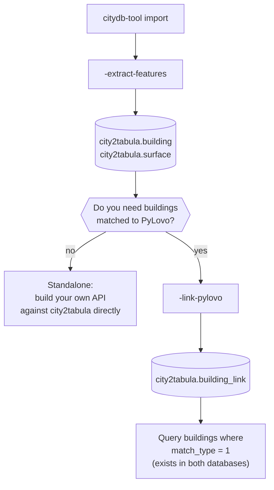

# Deployment Guide

City2TABULA always produces the same core output — enriched building and surface data in the `city2tabula` schema. What differs between deployments is what happens **after** extraction, depending on how the downstream system needs to consume that data. This page helps you pick the right path before you install anything; for the mechanical setup steps themselves, see [Setup and Installation](../installation/setup.md).

## The two paths

| | Standalone | PyLovo-linked |
|---|---|---|
| **Steps run** | citydb-tool import → `-extract-features` | citydb-tool import → `-extract-features` → `-link-pylovo` |
| **Final output** | `city2tabula.{lod}_building`, `city2tabula.{lod}_surface` | Standalone output, plus `city2tabula.building_link` |
| **Who queries it** | Your own API, built against the schema directly | Application code joins through `building_link` |
| **When to use it** | You only need City2TABULA's 3D building/surface data on its own terms | You need buildings that exist in *both* City2TABULA and a [PyLovo2EnerPlanET](https://github.com/enerplanet/pylovo2enerplanet) database — this is EnerPlanET's path |



!!! tip "Which path do I need?"
    Start standalone. Only add the `-link-pylovo` step once a downstream consumer — like EnerPlanET's model generation — actually needs to cross-reference City2TABULA buildings against PyLovo's building database. The link step is additive: it never changes `_building` or `_surface`, so you can add it later without redoing extraction.

---

## Path A: Standalone

Run citydb-tool import and `-extract-features` as described in [Setup and Installation](../installation/setup.md). Nothing further is required — the pipeline's output is the complete deliverable.

The consumer is responsible for their own read API against `city2tabula.{lod}_building` and `city2tabula.{lod}_surface` (see the [SQL Extraction Pipeline](../code/sql-pipeline/index.md) for exactly what each table contains). City2TABULA does not prescribe a query layer; [cityviz](https://github.com/thd-spatial-ai/cityviz) and [ignis](https://github.com/thd-spatial-ai/ignis) are examples of services that read this schema directly for their own purposes.

## Path B: PyLovo-linked (EnerPlanET)

EnerPlanET's grid-model generation needs buildings that exist in **both** City2TABULA's 3D dataset and PyLovo's OSM-derived building database — City2TABULA supplies the geometry, PyLovo supplies the grid topology, and a building is only useful for model generation if both sides agree it's the same building.

After `-extract-features`, run the additional link step:

```bash
./city2tabula -link-pylovo
```

This populates `city2tabula.building_link` with an IoU spatial match between each City2TABULA building and PyLovo's `res`/`oth` tables. Query it for `match_type = 1` to get buildings confirmed in both databases:

```sql
SELECT b.*, l.osm_id, l.pylovo_table
FROM city2tabula.lod2_building b
JOIN city2tabula.building_link l ON l.object_id = b.object_id
WHERE l.match_type = 1;
```

Full detail on the matching algorithm, configuration (`PYLOVO_SCHEMA`, `PYLOVO_LINK_GRID_SIZE`), the `building_link` schema, and match types is in [PyLovo Building Link](../code/pylovo-link/index.md).

!!! info "PyLovo must already have data"
    `-link-pylovo` reads from `pylovo.res`/`pylovo.oth`; it doesn't populate them. Those tables must already be loaded via [pylovo2enerplanet/datapipeline](https://github.com/enerplanet/pylovo2enerplanet/tree/main/datapipeline) before this step will find any matches.
