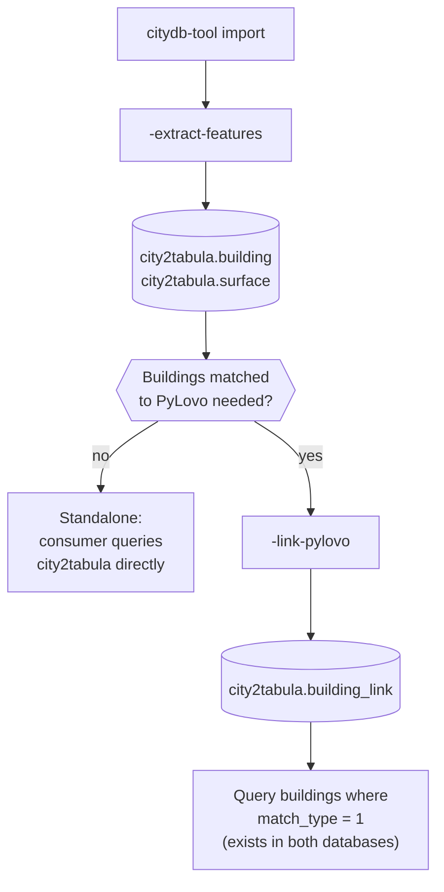

# Deployment Guide

Every deployment produces the same core output: enriched building and surface data in the `city2tabula` schema. What differs is what runs after extraction, which depends on how the downstream system consumes the data. The setup steps themselves are in [Setup and Installation](../installation/setup.md).

## The two paths

| | Standalone | PyLovo-linked |
|---|---|---|
| **Steps run** | citydb-tool import → `-extract-features` | citydb-tool import → `-extract-features` → `-link-pylovo` |
| **Final output** | `city2tabula.{lod}_building`, `city2tabula.{lod}_surface` | Standalone output, plus `city2tabula.building_link` |
| **Who queries it** | The consumer's own API, built against the schema directly | Application code joins through `building_link` |
| **When to use it** | The consumer needs City2TABULA's 3D building and surface data on its own | The consumer needs buildings present in both City2TABULA and an [enerplanet-pylovo](https://github.com/enerplanet/enerplanet-pylovo) database. This is EnerPlanET's path |


```mermaid
flowchart TD
    A["citydb-tool import"] --> B["-extract-features"]
    B --> C[("city2tabula.building<br>city2tabula.surface")]
    C --> D{{"Buildings matched<br>to PyLovo needed?"}}
    D -->|no| E["Standalone:<br>consumer queries<br>city2tabula directly"]
    D -->|yes| F["-link-pylovo"]
    F --> G[("city2tabula.building_link")]
    G --> H["Query buildings where<br>match_type = 1<br>(exists in both databases)"]
```

!!! tip "Choosing a path"
    Standalone is the starting point. The `-link-pylovo` step is only needed once a downstream consumer, such as EnerPlanET's model generation, cross-references City2TABULA buildings against PyLovo's building database. The link step is additive: it never changes `_building` or `_surface`, so it can be added later without redoing extraction.

---

## Path A: Standalone

Run citydb-tool import and `-extract-features` as described in [Setup and Installation](../installation/setup.md). Nothing further is required: the pipeline's output is the complete deliverable.

The consumer provides its own read API against `city2tabula.{lod}_building` and `city2tabula.{lod}_surface`. The [SQL Extraction Pipeline](../code/sql-pipeline/index.md) documents what each table contains. City2TABULA prescribes no query layer; [cityviz](https://github.com/thd-spatial-ai/cityviz) and [ignis](https://github.com/thd-spatial-ai/ignis) read this schema directly for their own purposes.

## Path B: PyLovo-linked (EnerPlanET)

EnerPlanET's grid-model generation needs buildings present in both City2TABULA's 3D dataset and PyLovo's OSM-derived building database. City2TABULA supplies the geometry and PyLovo the grid topology, and a building is only useful for model generation when both sides agree it is the same building.

After `-extract-features`, run the additional link step:

```bash
./c2t -link-pylovo
```

This populates `city2tabula.building_link` with an IoU spatial match between each City2TABULA building and PyLovo's `res` and `oth` tables. `match_type = 1` selects the buildings confirmed in both databases:

```sql
SELECT b.*, l.osm_id, l.pylovo_table
FROM city2tabula.lod2_building b
JOIN city2tabula.building_link l ON l.object_id = b.object_id
WHERE l.match_type = 1;
```

When the PyLovo database is on a separate server, which is the usual case since each country has its own City2TABULA database, set `PYLOVO_FDW_HOST` and the link step federates to it over `postgres_fdw`. The setup steps (the read-only PyLovo role, the `.env` variables and verification) are in [PyLovo Building Link, Federated setup](../code/pylovo-link/index.md#federated-setup-postgres_fdw).

Full detail on the matching algorithm, configuration, the `building_link` schema, and match types is in [PyLovo Building Link](../code/pylovo-link/index.md).

!!! info "PyLovo must already have data"
    `-link-pylovo` reads `pylovo.res` and `pylovo.oth` and does not populate them. Those tables must be loaded by [enerplanet-pylovo/datapipeline](https://github.com/enerplanet/enerplanet-pylovo/tree/main/datapipeline) before this step finds any matches.
