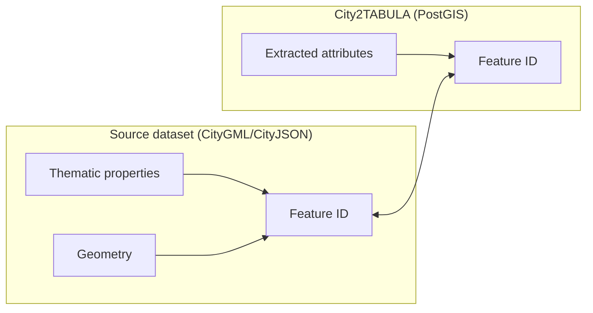

# Validation

City2TABULA derives building attributes purely from 3D geometry. This validation compares those computed values against thematic properties bundled in the same CityGML/CityJSON source files.

---

## How It Works

CityGML files carry two parallel data streams for each building:

- **Geometry** — LoD2/LoD3 polyhedral surfaces.
- **Thematic properties** — declared attributes (slope, area, height) stored as name–value pairs in `lod2.property`.

Validation links them via the CityDB feature ID:



!!! info "Direct match only"
    Only surfaces with a property row whose `feature_id` matches the surface's own ID are validated. Parent-level properties (e.g. slope stored on the building rather than each roof surface) are not inherited — see [Known Limitations](#known-limitations).

### Loading Strategy

Two directions depending on category:

| Category | Direction | Rationale |
| -------- | --------- | --------- |
| **Buildings** | City2TABULA → CityDB | Sample N building IDs, fetch their thematic height values. Buildings with no thematic data are excluded. |
| **Surfaces** | CityDB → City2TABULA | Find surface IDs that *have* the target attribute in CityDB AND exist in City2TABULA for the right classname, then sample N from that intersection. Starting from the source side guarantees N matched samples. |

### Attributes Validated

| Level | Attribute | Unit |
| ----- | --------- | ---- |
| Building | `min_height`, `max_height` | m |
| Roof surface | `surface_area`, `tilt`, `azimuth` | m², °, ° |
| Wall surface | `surface_area` | m² |
| Ground surface | `surface_area` | m² |

---

## Datasets

The May 2026 validation runs cover **entire municipalities** with no sample limit (`VALIDATION_LIMIT` unset).

!!! note "Building parts"
    City2TABULA counts BuildingParts as separate buildings. The building count in the table reflects distinct entries in the feature table, which may exceed the number of top-level `Building` elements in the source file.

| Dataset | Country | LoD | Buildings | Source | License | Tilt stored at |
| ------- | ------- | --- | --------- | ------ | ------- | -------------- |
| Deggendorf | Germany | LoD2 | 125,991 | [BayernAtlas](https://geodaten.bayern.de) | [CC BY 4.0](https://creativecommons.org/licenses/by/4.0/deed.de) | Surface level |
| Freiburg | Germany | LoD2 | 130,191 | [Geodatenkatalog der Stadt Freiburg im Breisgau](https://geodaten.freiburg.de/geonetwork/srv/ger/catalog.search#/home) | [dl-de/by-2.0](https://www.govdata.de/dl-de/by-2-0) — Datengrundlage: Stadt Freiburg | Building level |
| Vienna | Austria | LoD2.1 | 130,000 | [Stadt Wien – data.wien.gv.at](https://data.wien.gv.at) | [CC BY 4.0](https://creativecommons.org/licenses/by/4.0/deed.de) | Surface level |

!!! warning "Freiburg tilt and floor coverage"
    Baden-Württemberg stores `Dachneigung` at the Building/BuildingPart level — only ~64% of roof surfaces can be directly validated for tilt. More significantly, only 5.4% of GroundSurface features carry a thematic `Flaeche` (area) value (6,039 of 111,555), so floor area validation covers a small minority of the total floor population. Both are data provider conventions, not pipeline limitations.

!!! note "Vienna dataset size"
    The full Vienna export contains 384,931 buildings. The validation run processed a 130,000-building subset to match the scale of the other two datasets.

---

## Setup

### Requirements

```bash
cd city2tabula/validation
pip install -r requirements.txt
```

### Environment

Create a `.env` file at `city2tabula/.env`:

```bash
DB_HOST=localhost
DB_PORT=5432
DB_NAME=c2t_deggendorf
DB_USER=postgres
DB_PASSWORD=your_password
COUNTRY=germany
# VALIDATION_LIMIT=10000   # omit for full-dataset runs
```

---

## Running

### Step 1 — (Optional) Flag Attached Buildings

```bash
python flag_attached_buildings.py --lod lod2 --tolerance 0.5
```

!!! tip
    Run this before the notebook to enable the height accuracy split by `has_attached_neighbour` in Stage 3.5.

### Step 2 — Execute the Notebook

Open `validation.ipynb` in JupyterLab and run all cells, or run headless:

```bash
COUNTRY=germany DB_NAME=c2t_deggendorf \
    jupyter nbconvert --to notebook --execute validation.ipynb \
    --output validation_executed.ipynb
```

### Step 3 — Generate the Report

```bash
# Single dataset
python validation/generate_report.py validation/outputs/Germany/c2t_deggendorf

# Combined report across all three datasets
python validation/generate_report.py \
  --dataset "Freiburg (DE):validation/outputs/Germany/c2t_freiburg" \
  --dataset "Vienna (AT):validation/outputs/Austria/c2t_vienna_130k" \
  --dataset "Deggendorf (DE):validation/outputs/Germany/c2t_deggendorf" \
  --output validation/outputs/combined_report.md
```

See [Generating Reports](report.md) for full documentation of `generate_report.py`.

### Output Structure

```
outputs/{country}/{db_name}/validation_{timestamp}/
├── building_summary.csv
├── roof_summary.csv / wall_summary.csv / floor_summary.csv
├── *_validation.csv          # full per-surface results
├── problematic_roofs.csv     # surfaces with error > 10%
├── figs/plots/
│   ├── accuracy_summary.pdf
│   └── accuracy_summary.png
└── validation_report.md
```

---

## Configuration

Each dataset has a YAML config in `validation/configs/config_{country}.yaml`.

!!! example "Attribute mapping (Germany)"
    ```yaml
    attributes:
      parent:
        height:
          computed_columns: ["min_height", "max_height"]
          source_label: "value"
      child:
        roof:
          tilt:
            computed_column: "tilt"
            source_label: "Dachneigung"
          azimuth:
            computed_column: "azimuth"
            source_label: "Dachorientierung"
    ```

??? tip "Discovering property names in your dataset"
    ```sql
    SELECT DISTINCT name, COUNT(*) AS count
    FROM lod2.property
    GROUP BY name
    ORDER BY count DESC;
    ```

---

## Results

Full-dataset runs (May 2026). No sample limit — all matched surfaces validated.

### Accuracy Summary

RMSE and mean signed difference (calculated − reference) for each attribute.

=== "Deggendorf (DE)"

    | Attribute | n | RMSE | Mean diff |
    | --------- | - | ---- | --------- |
    | Tilt (°) | 290,064 | 0.038 | +0.003 |
    | Azimuth (°) | 243,119 | 1.087 | −0.523 |
    | Roof area (m²) | 290,064 | 0.042 | +0.013 |
    | Wall area (m²) | 843,789 | 38.177 | −0.265 |
    | Floor area (m²) | 125,991 | 0.120 | +0.029 |
    | Max height (m) | 125,991 | 3.514 | +2.818 |
    | Min height (m) | 125,991 | 2.148 | +0.816 |

=== "Freiburg (DE)"

    | Attribute | n | RMSE | Mean diff |
    | --------- | - | ---- | --------- |
    | Tilt (°) | 22,510 | 1.240 | +0.014 |
    | Azimuth (°) | 14,435 | 0.185 | +0.001 |
    | Roof area (m²) | 22,411 | 0.392 | −0.004 |
    | Wall area (m²) | 55,129 | 0.004 | 0.000 |
    | Floor area (m²) | 6,039 | 1.167 | −0.015 |
    | Max height (m) | 110,156 | 4.451 | +2.709 |
    | Min height (m) | 110,156 | 3.820 | +0.340 |

=== "Vienna (AT)"

    | Attribute | n | RMSE | Mean diff |
    | --------- | - | ---- | --------- |
    | Tilt (°) | 294,897 | 2.102 | +0.117 |
    | Azimuth (°) | 191,759 | 3.528 | +0.010 |
    | Roof area (m²) | 294,897 | 1.862 | −0.069 |
    | Wall area (m²) | 1,180,291 | 17.360 | −0.030 |
    | Floor area (m²) | 108,209 | 0.125 | 0.000 |
    | Max height (m) | 106,572 | 12.331 | +4.189 |
    | Min height (m) | 106,572 | 11.812 | +2.413 |

_n = number of matched surface comparisons. Azimuth differences wrapped to [−180°, 180°] before computing statistics._

---

### Error Distribution

Percentiles of |difference| and the fraction of comparisons exceeding 1 RMSE (heavy-tail indicator).

=== "Deggendorf (DE)"

    | Attribute | P5 | P25 | P75 | P95 | Tail (> 1 RMSE) |
    | --------- | -- | --- | --- | --- | --------------- |
    | Tilt (°) | 0.000 | 0.000 | 0.005 | 0.020 | 0.6% |
    | Azimuth (°) | 0.000 | 0.000 | 0.024 | 2.267 | 23.2% |
    | Roof area (m²) | 0.000 | 0.000 | 0.002 | 0.084 | 13.2% |
    | Wall area (m²) | 0.000 | 0.000 | 0.002 | 0.037 | 0.0% |
    | Floor area (m²) | 0.000 | 0.000 | 0.001 | 0.187 | 11.7% |
    | Max height (m) | 0.000 | 1.335 | 3.900 | 6.533 | 30.9% |
    | Min height (m) | 0.000 | 0.000 | 1.180 | 5.118 | 18.7% |

=== "Freiburg (DE)"

    | Attribute | P5 | P25 | P75 | P95 | Tail (> 1 RMSE) |
    | --------- | -- | --- | --- | --- | --------------- |
    | Tilt (°) | 0.000 | 0.000 | 0.008 | 0.051 | 0.1% |
    | Azimuth (°) | 0.000 | 0.001 | 0.078 | 0.284 | 11.6% |
    | Roof area (m²) | 0.000 | 0.000 | 0.001 | 0.005 | 0.0% |
    | Wall area (m²) | 0.000 | 0.000 | 0.002 | 0.008 | 12.7% |
    | Floor area (m²) | 0.000 | 0.000 | 0.000 | 0.001 | 0.0% |
    | Max height (m) | 0.000 | 0.050 | 4.059 | 8.518 | 21.4% |
    | Min height (m) | 0.000 | 0.003 | 3.383 | 6.919 | 20.5% |

=== "Vienna (AT)"

    | Attribute | P5 | P25 | P75 | P95 | Tail (> 1 RMSE) |
    | --------- | -- | --- | --- | --- | --------------- |
    | Tilt (°) | 0.000 | 0.000 | 0.006 | 0.021 | 0.4% |
    | Azimuth (°) | 0.000 | 0.002 | 0.010 | 0.055 | 0.1% |
    | Roof area (m²) | 0.000 | 0.001 | 0.004 | 0.007 | 0.3% |
    | Wall area (m²) | 0.000 | 0.001 | 0.004 | 0.006 | 0.0% |
    | Floor area (m²) | 0.000 | 0.001 | 0.004 | 0.006 | 0.0% |
    | Max height (m) | 0.002 | 1.360 | 5.690 | 12.425 | 5.1% |
    | Min height (m) | 0.000 | 0.004 | 3.560 | 10.649 | 4.2% |

---

### Geometry Quality

Per surface type: fraction of surfaces flagged as invalid (`ST_IsValid = false`) or non-planar. Counted on unique surfaces (area attribute rows only).

| Dataset | Surface type | n surfaces | Invalid (%) | Non-planar (%) |
| ------- | ------------ | ---------- | ----------- | -------------- |
| Deggendorf (DE) | Roof | 290,064 | 0.0% | 84.3% |
| Deggendorf (DE) | Wall | 843,789 | 78.8% | 26.7% |
| Deggendorf (DE) | Floor | 125,991 | 0.0% | 0.0% |
| Freiburg (DE) | Roof | 22,411 | 0.0% | 52.2% |
| Freiburg (DE) | Wall | 55,129 | 89.0% | 13.1% |
| Freiburg (DE) | Floor | 6,039 | 0.0% | 0.1% |
| Vienna (AT) | Roof | 294,897 | 0.0% | 63.9% |
| Vienna (AT) | Wall | 1,180,291 | 99.4% | 17.2% |
| Vienna (AT) | Floor | 108,209 | 0.0% | 0.0% |

!!! note "n = validated surfaces only"
    `n surfaces` counts surfaces that have a matching thematic property in the source CityGML — not the total population. Surfaces without a thematic value are excluded from validation entirely.

!!! warning "Freiburg floor area coverage"
    Freiburg contains **111,555** GroundSurface features, but only **6,039 (5.4%)** carry a thematic `Flaeche` (area) property. The remaining 105,516 ground surfaces have no declared area value and are therefore excluded from the floor area comparison. The `n surfaces = 6,039` in the table above reflects this validated subset, not the total. Deggendorf (125,991/125,991) and Vienna (318,256/318,258) have near-100% floor area coverage.

!!! note "Wall `is_valid`"
    High invalid rates for wall surfaces are a PostGIS `ST_IsValid` artefact of vertical planar polygons (zero-area 2D projection), not a defect that affects the 3D area calculation.

---

### Surface Area RMSE by Geometry Validity

RMSE split into valid+planar surfaces vs surfaces failing either check. This isolates the contribution of degenerate geometry to overall error.

| Dataset | Surface type | RMSE all (m²) | RMSE valid+planar (m²) | RMSE invalid/non-planar (m²) | n valid+planar | n invalid/non-planar |
| ------- | ------------ | ------------- | ---------------------- | ---------------------------- | -------------- | -------------------- |
| Deggendorf (DE) | Roof | 0.042 | 0.034 | 0.043 | 45,462 | 244,602 |
| Deggendorf (DE) | Wall | 38.177 | 0.016 | 38.256 | 3,482 | 840,307 |
| Freiburg (DE) | Roof | 0.392 | 0.002 | 0.542 | 10,712 | 11,699 |
| Freiburg (DE) | Wall | 0.004 | 0.002 | 0.004 | 609 | 54,520 |
| Vienna (AT) | Roof | 1.862 | 1.668 | 1.964 | 106,433 | 188,464 |
| Vienna (AT) | Wall | 17.360 | 0.003 | 17.362 | 240 | 1,180,051 |

!!! tip "The geometry argument"
    Wall RMSE for invalid/non-planar surfaces is **2,431×** higher than valid+planar in Deggendorf, and **6,096×** higher in Vienna. When the valid+planar subset is isolated, wall area RMSE drops to 0.003–0.016 m² — confirming that geometry quality in the source data, not the extraction pipeline, drives the elevated overall RMSE.

---

### Building Height RMSE by Attachment Status

| Dataset | Attribute | RMSE all (m) | RMSE detached (m) | RMSE attached (m) | n detached | n attached |
| ------- | --------- | ------------ | ----------------- | ----------------- | ---------- | ---------- |
| Deggendorf (DE) | Min height (m) | 2.148 | 2.148 | — | 125,991 | 0 |
| Deggendorf (DE) | Max height (m) | 3.514 | 3.514 | — | 125,991 | 0 |
| Freiburg (DE) | Min height (m) | 3.820 | 3.820 | — | 110,163 | 0 |
| Freiburg (DE) | Max height (m) | 4.451 | 4.451 | — | 110,163 | 0 |
| Vienna (AT) | Min height (m) | 11.813 | 11.813 | — | 106,572 | 0 |
| Vienna (AT) | Max height (m) | 12.331 | 12.331 | — | 106,572 | 0 |

!!! note
    No attached buildings were detected in any of the three datasets; the `has_attached_neighbour` column was populated by `flag_attached_buildings.py`. Height results therefore represent detached buildings only.

---

## Discussion

### Accuracy vs Data Convention

Deggendorf (Bavaria) achieves the lowest RMSE on roof tilt (0.038°) and roof area (0.042 m²) because tilt is stored at surface level — the feature ID match is direct. Freiburg's tilt RMSE (1.240°) is higher because Baden-Württemberg exports `Dachneigung` at the BuildingPart level; validation can only match ~64% of roof surfaces, and those matches carry more noise from the parent-to-surface propagation.

Wall area RMSE for Deggendorf (38.2 m²) and Vienna (17.4 m²) looks alarming at first. The stratification table tells the actual story: when only valid+planar surfaces are considered, wall area RMSE drops to 0.016 m² and 0.003 m² respectively. The elevated global RMSE is entirely attributable to PostGIS-invalid wall polygons in the source CityGML.

### Geometry Quality and Error Stratification

The `is_valid` and `is_planar` flags are derived from PostGIS `ST_IsValid` and a planarity check during extraction.

!!! warning "Wall `is_valid` rates"
    Nearly all wall surfaces are `is_valid = false` across all three datasets (79–99%). This is a known PostGIS behaviour for vertical planar polygons whose 2D projection has zero area. The 3D area computation is unaffected; the issue is purely in how `ST_IsValid` evaluates degenerate 2D projections.

!!! tip "Recommended handling"
    When `is_valid = false` or `is_planar = false`, prefer the thematic value from the source dataset. The CityDB feature ID is always preserved, so the source value is accessible via `lod2.property`.

### Height Errors

Max height shows a consistent positive bias across all three datasets (Deggendorf +2.82 m, Freiburg +2.71 m, Vienna +4.19 m). This systematic offset reflects the geometry-based derivation: `max_height` is taken from the highest vertex across all surfaces assigned to a building, which can include vertices from adjacent building geometry incorrectly included during the `ST_3DIntersects` surface assignment step.

The larger Vienna height RMSE (12.3 m vs 3.5–4.5 m for Germany) is consistent with Vienna's LoD2.1 geometry being structurally more complex — more surfaces per building means more opportunities for mis-assignment.

### Azimuth Tail Distribution

Azimuth tail fractions (fraction of comparisons where |difference| > 1 RMSE) are notably high in Deggendorf (23.2%) vs Vienna (0.1%). This reflects the heavier tails of the Deggendorf azimuth error distribution (P95 = 2.267° vs 0.055°), likely linked to the higher proportion of non-planar roof surfaces (84.3% vs 63.9%) producing less stable normal-vector estimates.

---

## Known Limitations

| Issue | Status |
| ----- | ------ |
| Building-level tilt (BW/Freiburg) not inherited to surfaces | By design — direct match only; requires child/parent relation resolver to extend |
| Netherlands 3D BAG validation | Blocked — LoD1+LoD2 combined; property feature IDs do not match extraction IDs |
| Wall area inaccurate for PostGIS-invalid geometry | Known — last-resort h×w approximation overestimates for degenerate polygons |
| Neighbour detection not wired to main pipeline | Use `flag_attached_buildings.py` as standalone script |
| No attached buildings in current datasets | Height RMSE split by attachment status cannot be evaluated until datasets with shared walls are tested |

---

## Reproducing Results

1. Install City2TABULA — see [Setup & Installation](../installation/setup.md).
2. Download the source datasets from the links in the [Datasets](#datasets) table.
3. Import: `city2tabula -create-db`.
4. Extract: `city2tabula -extract-features`.
5. Set `configs/config_{country}.yaml` and `.env` for your dataset.
6. Run `validation.ipynb` (no `VALIDATION_LIMIT` for full-dataset runs).
7. Run `python validation/generate_report.py` to produce the report and accuracy plot.

All validation code lives in `city2tabula/validation/`. The notebook is self-contained.
